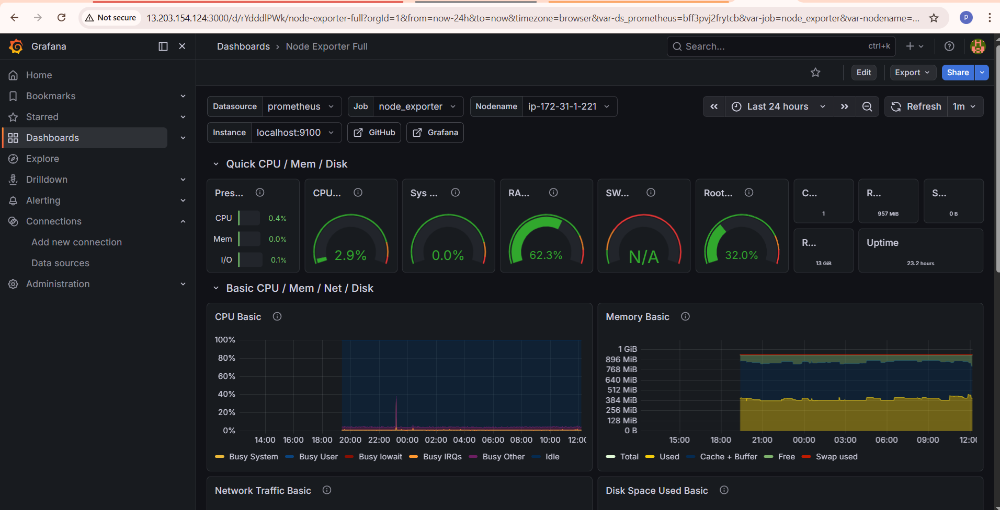
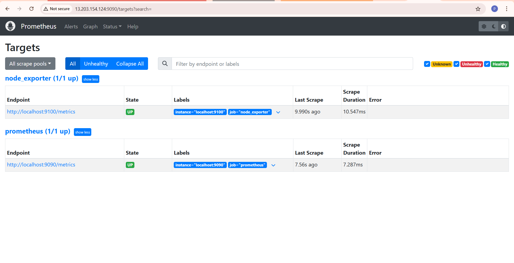
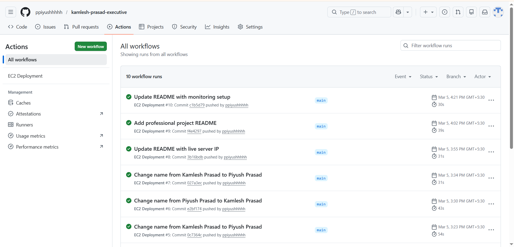

# DevOps Monitoring and CI/CD Deployment Project

## Project Overview

This project demonstrates a practical DevOps workflow where a web application is automatically deployed to an AWS EC2 server and monitored using a modern monitoring stack.

The application is served using Nginx while infrastructure metrics are collected using Node Exporter. Prometheus continuously scrapes these metrics and stores them as time-series data. Grafana connects to Prometheus and visualizes the system performance through interactive dashboards.

This setup represents a simplified production-style monitoring environment used in real DevOps infrastructure.

Server Public IP
13.203.154.124

---

## Architecture

User → Nginx Web Server → Website

Monitoring Stack
Node Exporter → Prometheus → Grafana

Deployment Pipeline
GitHub Repository → GitHub Actions → EC2 Deployment

---

## Technologies Used

AWS EC2 (Ubuntu Server)

Nginx (Web Server)

GitHub Actions (CI/CD Pipeline)

Prometheus (Metrics Collection)

Node Exporter (System Metrics Exporter)

Grafana (Monitoring Dashboard)

Linux Systemd Services

Git and GitHub

---

## Key Features

Automatic deployment using GitHub Actions

Nginx hosting the production build of the website

Real-time infrastructure monitoring

CPU usage monitoring

Memory usage monitoring

Disk utilization monitoring

Network traffic monitoring

Prometheus time-series metrics storage

Grafana dashboards for visualization

System services managed using systemd

---

## EC2 Server Setup

Launch an AWS EC2 Ubuntu instance.

Update system packages.

sudo apt update

Install required tools.

sudo apt install nginx git nodejs npm

Clone the repository.

git clone https://github.com/your-repository/project.git

---

## Nginx Configuration

Nginx is used as the web server to host the application.

Default web directory

/var/www/html

Restart nginx

sudo systemctl restart nginx

Access the website

http://13.203.154.124

---

## CI/CD Deployment Using GitHub Actions

A GitHub Actions workflow automatically deploys updates to the EC2 server.

Workflow process

Connect to EC2 server using SSH

Pull latest source code from GitHub

Install dependencies

Build the project

Copy build files to Nginx directory

Restart Nginx service

Deployment is triggered whenever code is pushed to the main branch.

---

## Node Exporter Setup

Node Exporter collects hardware and operating system metrics from the EC2 server.

Metrics collected

CPU usage

Memory usage

Disk usage

Network statistics

Node Exporter runs on port

9100

Metrics endpoint

http://13.203.154.124:9100/metrics

---

## Prometheus Setup

Prometheus scrapes metrics from Node Exporter and stores them in a time-series database.

Scrape target

localhost:9100

Prometheus runs on port

9090

Prometheus web interface

http://13.203.154.124:9090

Prometheus continuously collects and stores monitoring data.

---

## Grafana Setup

Grafana is used for visualizing monitoring data collected by Prometheus.

Grafana runs on port

3000

Grafana dashboard

http://13.203.154.124:3000

Default login credentials

Username: admin
Password: admin

Grafana connects to Prometheus as a data source and displays system performance metrics.

---

## Grafana Dashboard

The project uses the Node Exporter Full dashboard from the Grafana dashboard library.

Dashboard ID

1860

Metrics displayed

CPU usage

Memory usage

Disk utilization

Network traffic

System load

Filesystem usage

---

## Monitoring Flow

Node Exporter collects server metrics.

Prometheus scrapes metrics from Node Exporter.

Prometheus stores the data.

Grafana queries Prometheus.

Grafana dashboards visualize server performance.

---

## Project Screenshots

### Grafana Monitoring Dashboard

This dashboard visualizes CPU, memory, disk usage, and system metrics collected from the EC2 instance.

---

### Prometheus Targets

Prometheus successfully scraping metrics from Node Exporter and monitoring the EC2 server.

---

### GitHub Actions CI/CD Pipeline

Automated deployment pipeline that deploys the application to the EC2 server when code is pushed to the repository.

---

## Running Services

All monitoring components run as Linux system services.

node_exporter.service

prometheus.service

grafana-server.service

nginx.service

This ensures all services automatically start when the server reboots.

---

## Future Improvements

Add custom domain with DNS configuration

Enable HTTPS using Let's Encrypt SSL certificates

Implement Prometheus Alertmanager for alerting

Add application-level monitoring

Containerize the application using Docker

Provision infrastructure using Terraform

Implement centralized logging

---

## Author

Piyush Prasad

DevOps Monitoring and Deployment Project
